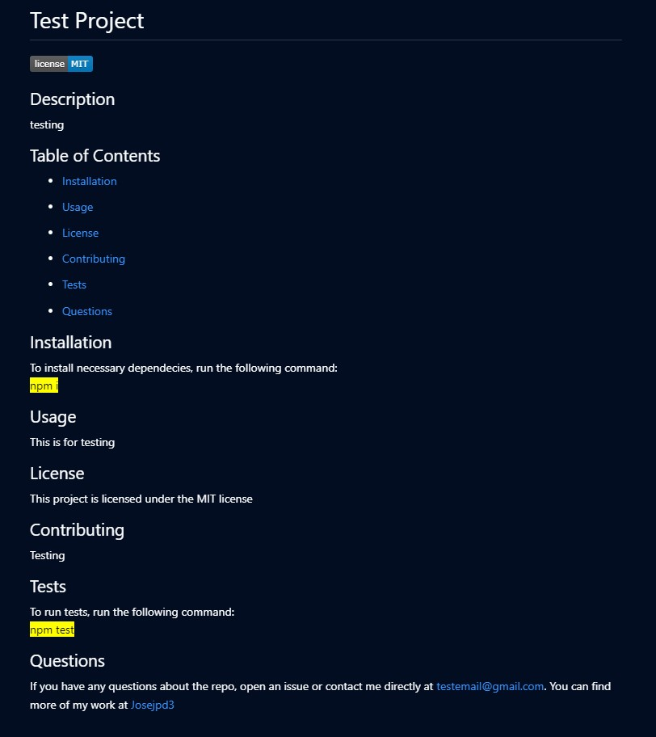

# 09-Module-Challenge

### Node.js Challenge: Professional README Generator

---

## README Generator

The README Generator is a quick and easy way to create a proffesional README file for your next project. Just run the application and answer a few questions about your project and then you are automatically generated a new README.

---

## Instructions [(Walk Through Video)](https://drive.google.com/file/d/1fxe6FqIkWHd2G3RfxePwzP5NvEVNQr46/view) 

1. Clone down the repository
```
git clone git@github.com:Josejpd3/09-Module-Challenge.git
```
2. Enter in to **09-Module-Challenge/develop** folder
```
cd 09-Module-Challenge/develop
```
3. Install dependencies
```
npm i
```
4. Run the application
```
node index.js
```
5. Answer the following prompt questions:
- What is your GitHub username?
- What is your email address?
- What is your project's name?
- Please write a short description of your project:
- What kind of license should your project have?
- What command should be run to install dependencies?
- What command should be run to run tests?
- What does the user need to know about using the repo?
- What does the user need to know about contributing to the repo?

After Completing these steps your README.md file will be generated inside the develop folder.

## Example README

